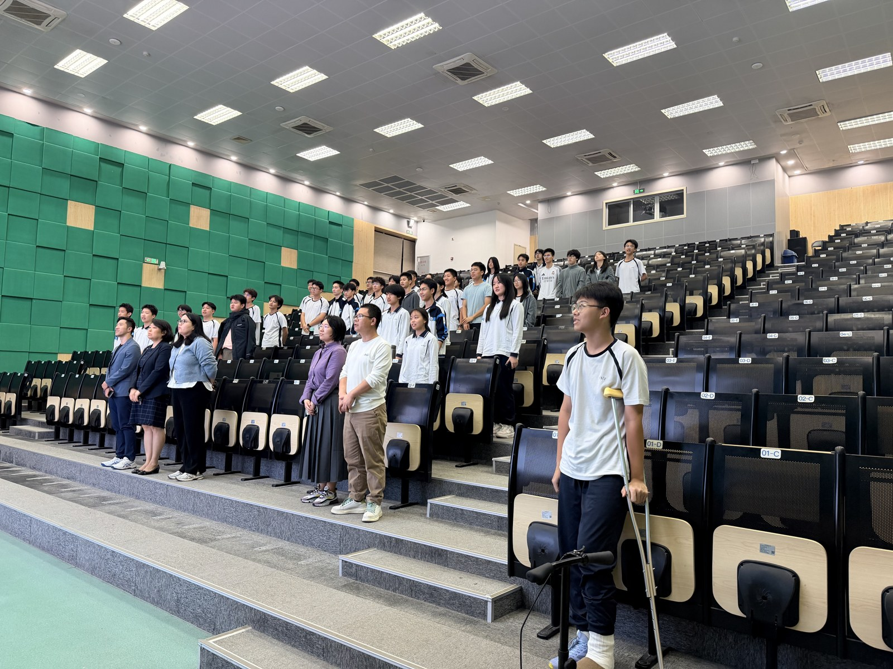
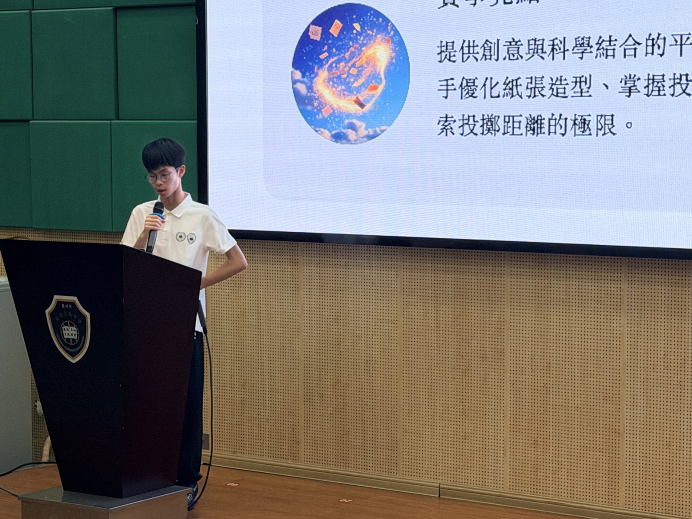
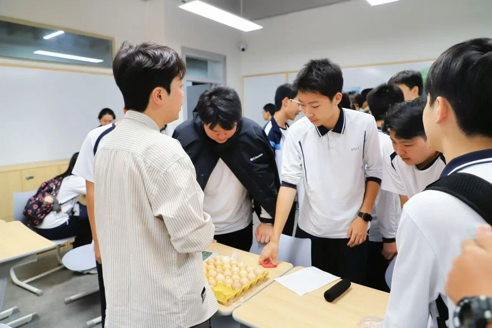
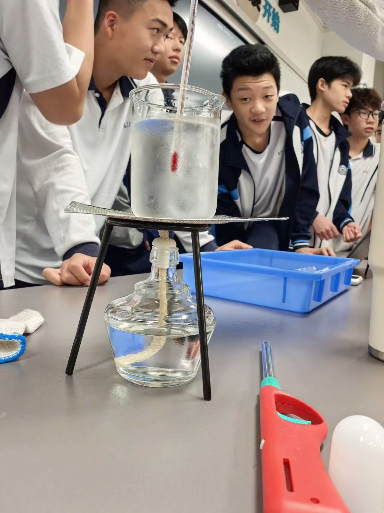
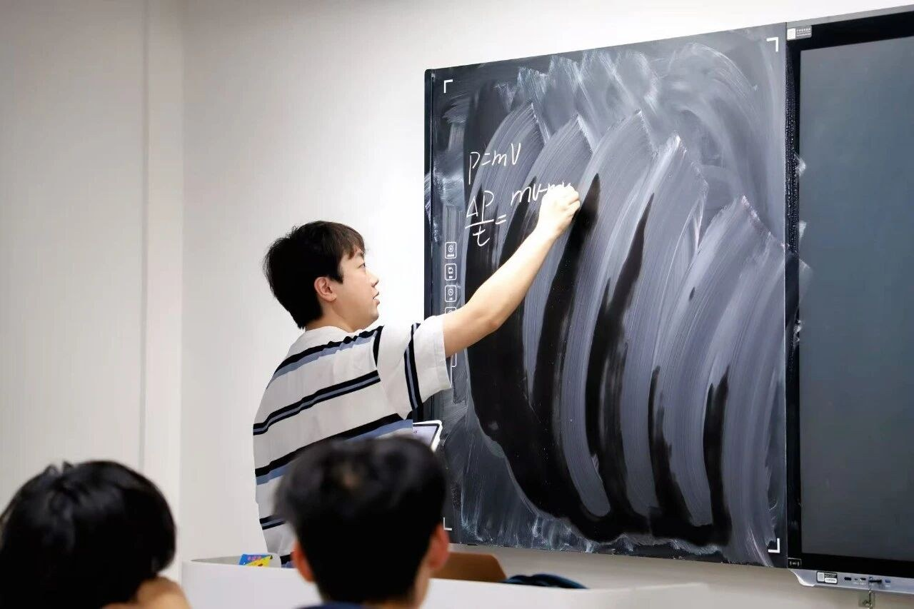
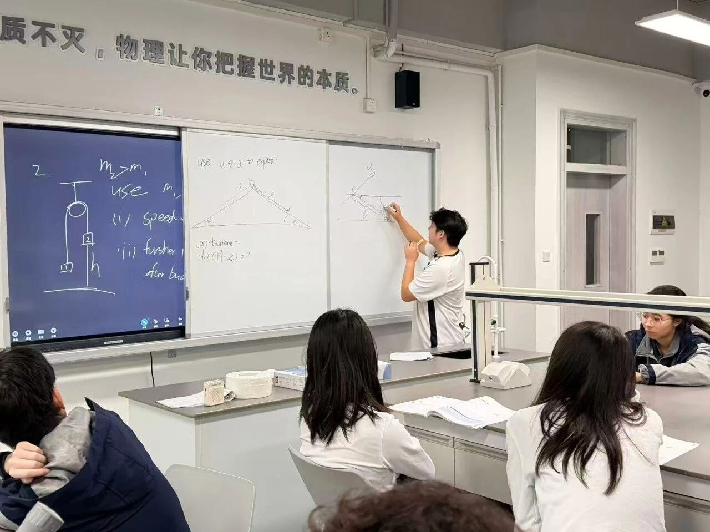
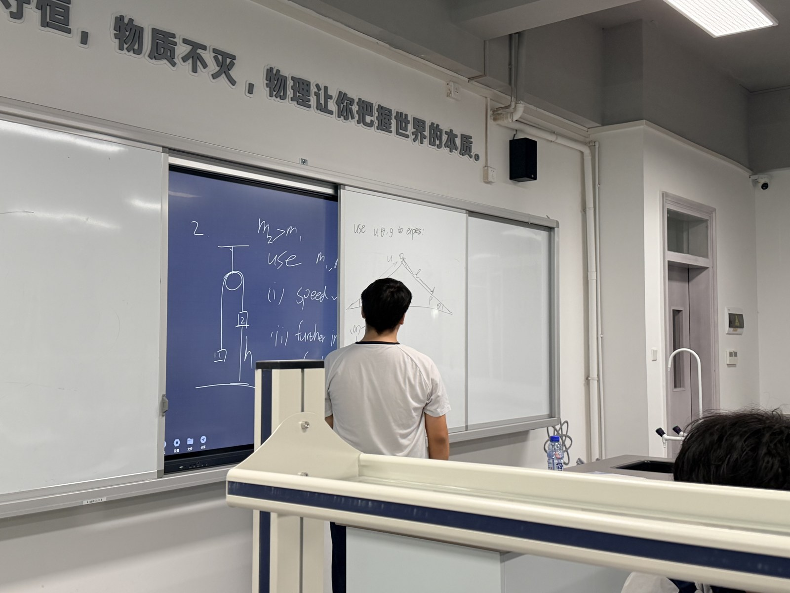
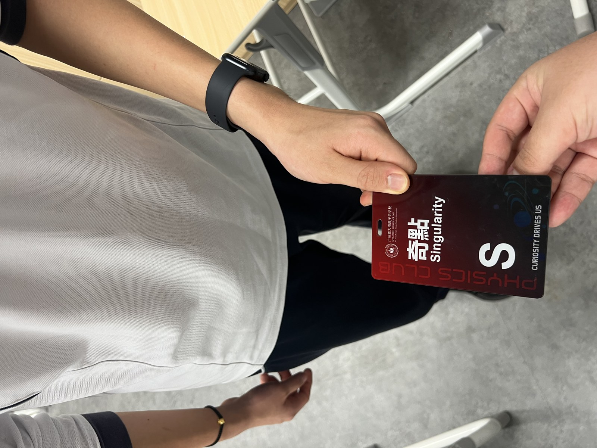
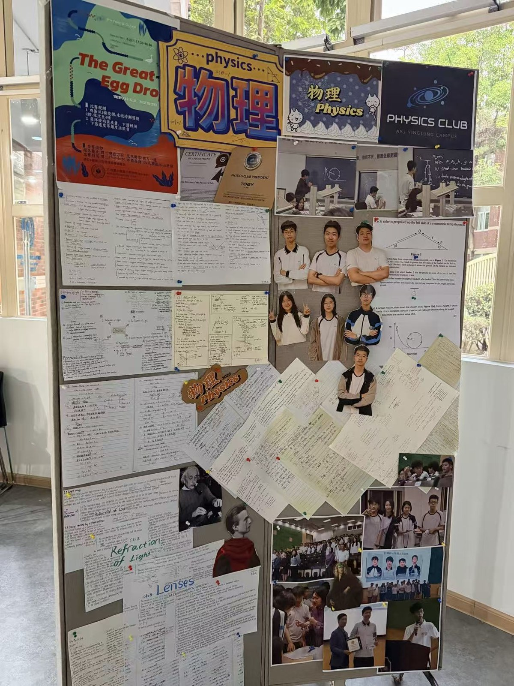

# 影像档案

04 / THE MEMORY COLLECTION · THE PHOTO ARCHIVE

## 有些瞬间，不会散场

这里的照片都来自留存资料。
**不为每一张照片补写故事，只记下我们能看见的瞬间。**

!!! note "拍摄日期说明"
    留存资料的多数照片**未注明具体拍摄日期**。
    本站不据活动顺序反推拍摄时间，只按可辨识的场景归类。

## 相聚

我们曾经，聚在同一个问题前。
一间教室，一块黑板，一群不满足于标准答案的人。

-   __01 / 同框的我们__

    ---

    { loading=lazy }

    /// caption
    阶梯教室中的师生合影
    ///

-   __06 / 站在一起的时刻__

    ---

    { loading=lazy }

    /// caption
    礼堂中的合影
    ///

-   __07 / 让热爱被听见__

    ---

    { loading=lazy }

    /// caption
    讲台前的发言
    ///

## 探索

答案要亲手试过。

-   __02 / 围在同一个想法旁__

    ---

    { loading=lazy }

    /// caption
    同学们在实验桌边讨论
    ///

-   __05 / 答案要亲手试过__

    ---

    { loading=lazy }

    /// caption
    同学们观察实验装置
    ///

## 课堂

把思路写在黑板上。

-   __03 / 把思路写在黑板上__

    ---

    { loading=lazy }

    /// caption
    黑板前的物理讲解
    ///

-   __04 / 一段被分享的思考__

    ---

    { loading=lazy }

    /// caption
    教室里的分享场景
    ///

-   __10 / 课堂上的讲解与聆听__

    ---

    { loading=lazy }

    /// caption
    课堂上的讲解与聆听
    ///

## 物件

一份小小的归属感。

-   __08 / 一份小小的归属感__

    ---

    { loading=lazy }

    /// caption
    手中留存的社团成员牌
    ///

-   __09 / 让记录留在墙上__

    ---

    { loading=lazy }

    /// caption
    活动照片与文字组成的展示板
    ///

## 关于这些照片

照片来自资料目录中的 `微信assets`。
图片经过适合网页浏览的尺寸与格式优化，**未使用网络示意图冒充社团活动**。

原始设计图与矢量物料见 [设计原档](../design/index.md)。

---

## 原始件清单

资料目录 [现场照片原图](../../about/sources/index.md#photo-assets "微信assets/") 共留存 **19 个图片文件**。
文件名保留了微信的时间戳，因此**每一张都有可考的精确时间**。

!!! warning "这些时间的含义"
    微信文件名中的时间戳记录的是**文件被微信处理／保存的时刻**，
    通常与拍摄时间接近，但**不等同于快门时间**。
    本站据此归纳活动发生的大致时段，不据此认定精确拍摄时刻。

### 2026 年 4 月 20 日 · 8 张

| 时间 | 文件（`微信图片_` 之后） | 尺寸 | 像素比 |
| --- | --- | --- | --- |
| 13:18:29 | `20260420131829_71_67.jpg` | 5712 × 4284 | 4:3 |
| 13:18:46 | `20260420131846_79_67.jpg` | 5712 × 4284 | 4:3 |
| 13:18:47 | `20260420131847_80_67.jpg` | 3726 × 4148 | 竖幅 |
| 13:18:49 | `20260420131849_81_67.jpg` | 4032 × 3024 | 4:3 |
| 13:18:51 | `20260420131851_82_67.jpg` | 5712 × 4284 | 4:3 |
| 13:19:01 | `20260420131901_86_67.jpg` | 1280 × 1707 | 3:4 |
| 13:46:45 | `20260420134645_143_58.jpg` | 1279 × 1706 | 3:4 |
| 21:34:23 | `20260420213423_474_8.jpg` | 4032 × 3024 | 4:3 |

!!! note "13:18:29 – 13:19:01 是一组连拍"
    **6 张照片在 32 秒内完成**，说明这是一次连续拍摄
    （同一场景的多个角度或连续动作），而非分散记录。

    当晚 21:34 另有一张单独留存。

### 2026 年 4 月 21 日 · 11 张

4 月 21 日正是**第一次集会暨招新的当天**。

| 时间 | 文件（`微信图片_` 之后） | 尺寸 | 像素比 |
| --- | --- | --- | --- |
| 12:35:47 | `20260421123547_475_8.jpg` | 1280 × 853 | 3:2 |
| 12:35:48 | `20260421123548_476_8.jpg` | 1280 × 853 | 3:2 |
| 12:50:57 | `20260421125057_478_8.png` | 610 × 1490 | 长竖幅 |
| 12:52:27 | `20260421125227_480_8.jpg` | 2310 × 1320 | 横幅 |
| 12:52:31 | `20260421125231_481_8.jpg` | 4032 × 3024 | 4:3 |
| 13:01:47 | `20260421130147_485_8.jpg` | 2354 × 3139 | 3:4 |
| 13:02:48 | `20260421130248_486_8.jpg` | 1280 × 2277 | 竖幅 |
| 13:06:05 | `20260421130605_487_8.jpg` | 1280 × 959 | 4:3 |
| 13:06:06 | `20260421130606_488_8.jpg` | 1280 × 853 | 3:2 |
| 13:06:07 | `20260421130607_489_8.jpg` | 1280 × 959 | 4:3 |
| 13:16:48 | `20260421131648_491_8.jpg` | 4125 × 5500 | 3:4 |

!!! note "全部集中在中午 12:35–13:17"
    11 张照片全部落在**41 分钟**内，且都在**中午**。

    4.21 集会的开场口语稿以「大家**晚上**好」起首，
    说明集会本身在晚上举行。因此这批照片记录的是
    **集会之前的时段**——彩排、场地准备或授牌环节的前期工作。

    其中 13:06:05 / 13:06:06 / 13:06:07 三张跨越 2 秒，是另一组连拍。

### 两天的分布

| 日期 | 时段 | 张数 | 时间上的归纳 |
| --- | --- | --- | --- |
| 4 月 20 日 | 下午 13:18–13:46 | 7 | 集会前一日 |
| 4 月 20 日 | 晚间 21:34 | 1 | 单独留存 |
| 4 月 21 日 | 中午 12:35–13:17 | 11 | 集会当天，集会之前 |
| — | **合计** | **19** | — |

!!! warning "本站不推断的部分"
    留存材料中**没有任何一张照片注明拍摄者、具体地点或活动环节**。
    上表最后一列仅为**时间上的归纳**，不构成对照片内容的认定。

### 关于页面照片与原始件的对应

本站页面上的照片是这批原始件的**再编码版本**[^recode]。

???+ note "未逐一标注来源文件的理由"
    留存件中有多张照片的**尺寸完全相同**
    （例如 `20260421123547`、`20260421123548`、`20260421130606`
    均为 1280 × 853），再编码后无法仅凭文件属性确定唯一的对应关系。

    因此本站**不为每张页面照片标注原始文件名**——
    在证据不足时给出确定答案，比不给答案更糟。

[^recode]: 已按适合网页浏览的尺寸与格式优化。
