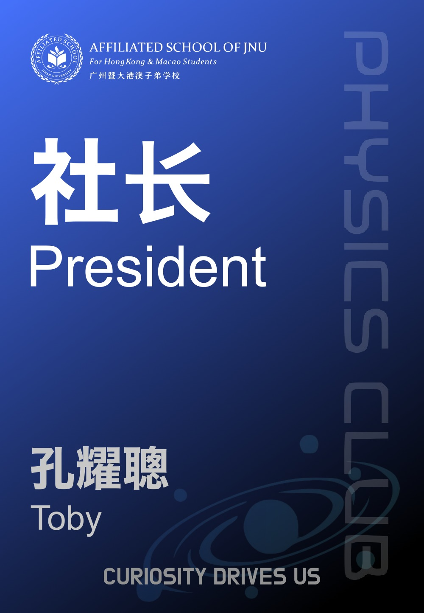
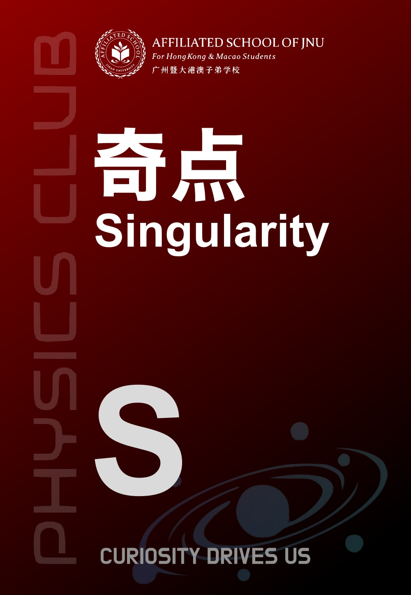
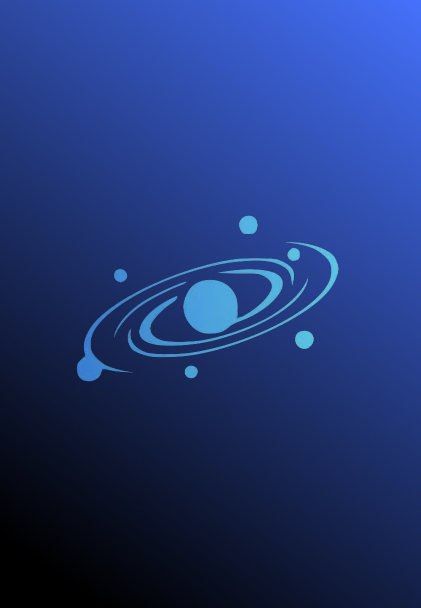
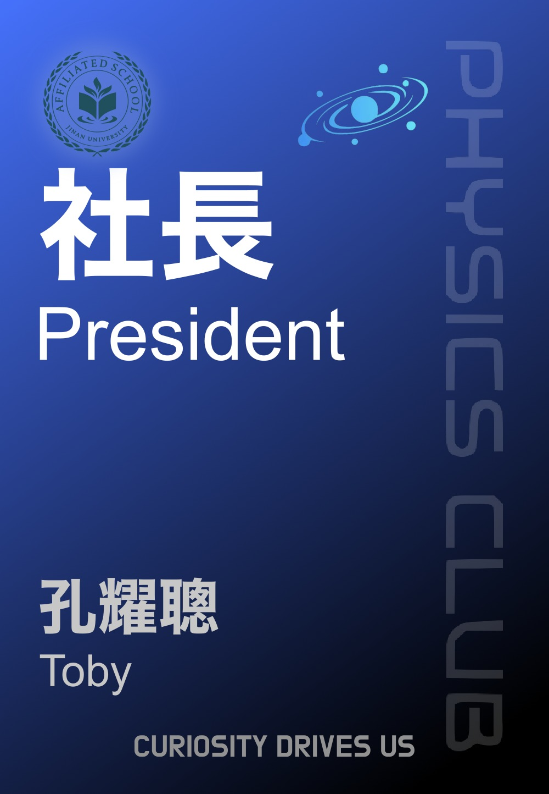
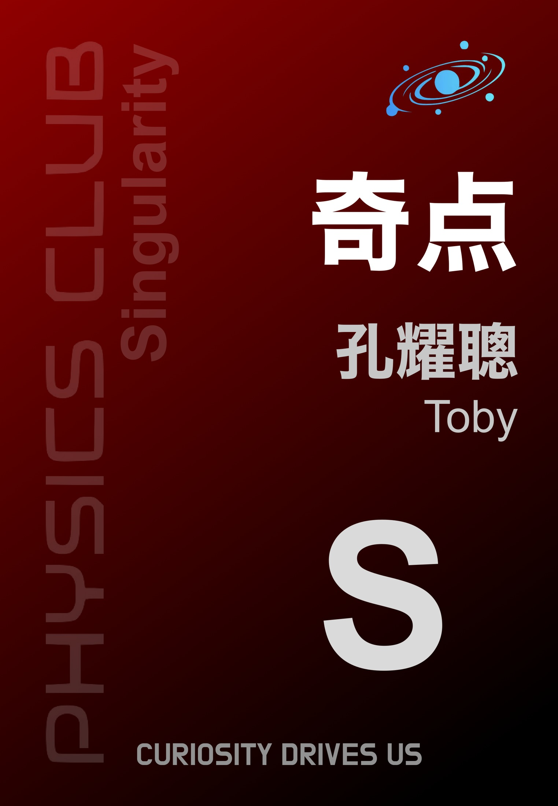
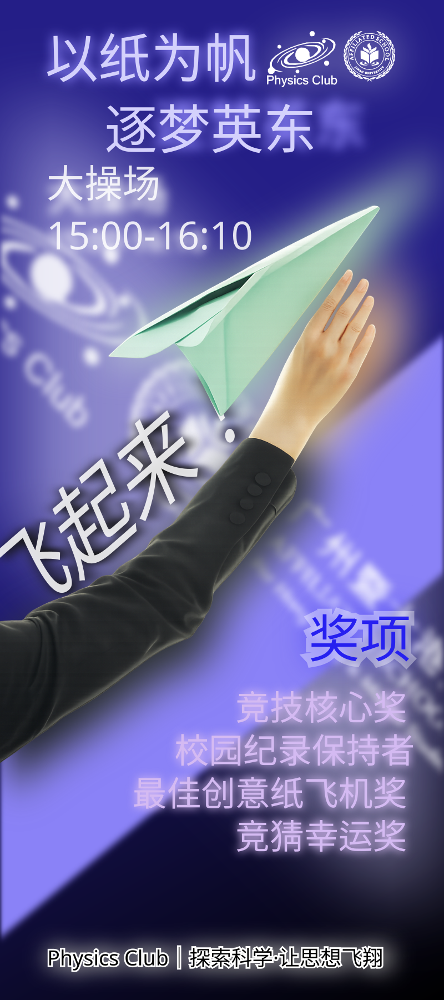
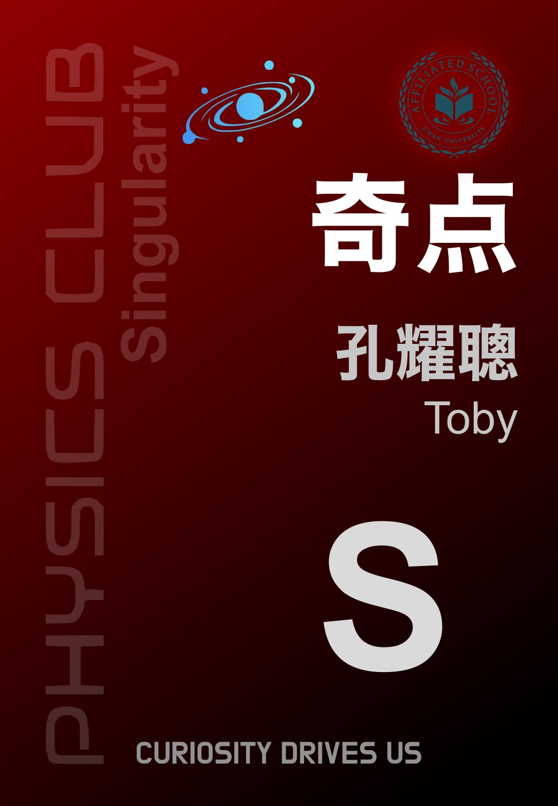
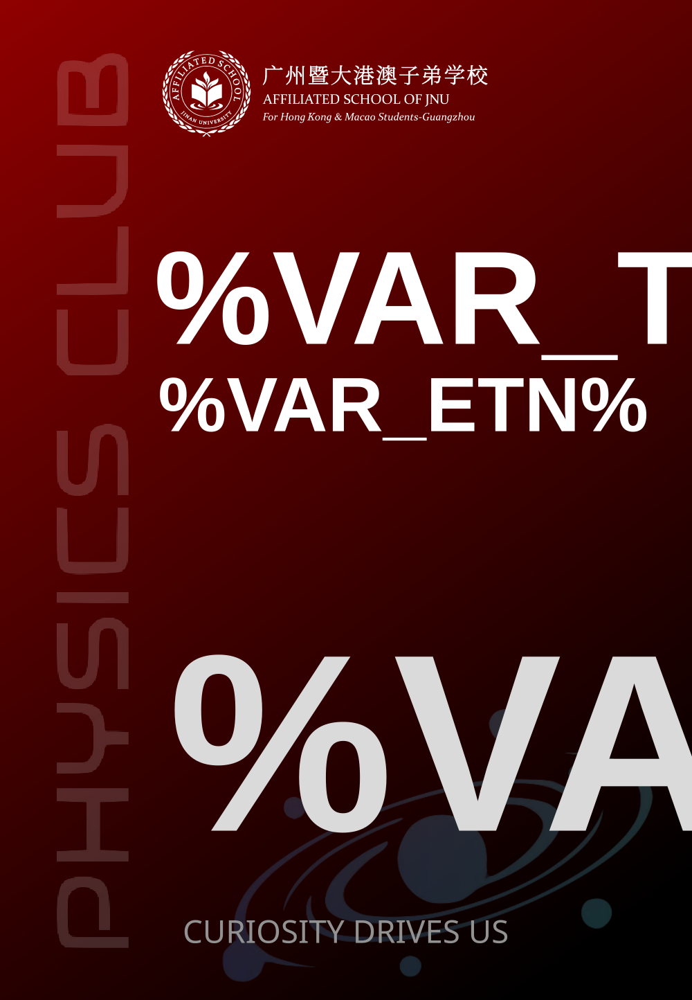

# Design Archive

05 / THE MEMORY COLLECTION · DESIGN ARCHIVE

!!! info "Sources"
    The club badge is a **parametric design project**, not just a few images. The original project is in `资料/物理社工牌/`:

    - `README.txt` — notes on the design process: edit `物理社工牌设计全部模板.svgz` in Inkscape,
      export every page in batch, then use NextGenerator to generate page by page from the fill-in roster, with the output placed in `dist`
    - `source/物理社工牌设计全部模板.svgz` — the source project behind all the templates
    - `source/物理社成员组填充名单.csv` — group names, the codes `S/N/P/M` and colour values
    - `source/物理社管理层填充名单.csv` — the roles and English names of the 14 officers
    - `source/*.svg` — front and back vector templates for the member groups and the officers
    - `material/*.ttc` — fonts (the Microsoft YaHei family + BMDOHYEON)

    Filter these out and the badge is just an image; keep them and it is a reproducible design.

## Letting the original designs speak for themselves

Those blues, those characters, those carefully arranged details.
From club badge to guide signs, keeping them as they were.

## Every orbit once pointed at the same place

The blue club emblem used here comes from the surviving original artwork. Around it the club built a whole visual system:
badges, group marks, guide signs, posters — colour and type all grown from the same emblem.

## A tour of the original designs

-   __Blue Officers Badge__

    ---

    

    Officer template · original export

-   __Singularity Group Member Badge__

    ---

    

    Group mark · original export

-   __The Back of a Club Emblem__

    ---

    

    Blue reverse · original export

-   __Second-Version Officers Badge__

    ---

    

    Second-version draft · original export

-   __Early Member Badge__

    ---

    

    Member badge draft · original export

-   __Paper for Sails__

    ---

    

    Flight festival poster · original SVG

-   __Second-Version Singularity Group Badge__

    ---

    

    Second-version draft · original export

-   __Names Still to Be Filled In__

    ---

    

    Member group front · original SVG template

## Different versions of one badge

Details, too, are worth keeping.

!!! warning "The difference between a draft and the released version"
    What follows are drafts left behind in an **obsolete design directory**.
    This site does not presume them to be the versions finally handed out — archiving is not the same as certifying.

| Version | File | Notes |
| --- | --- | --- |
| Officer template · President | `badge-president.jpg` | Original export of the blue officers badge |
| Officer template · Back | `badge-back.jpg` | Blue reverse |
| Singularity group · Large group lettering | `badge-singularity.jpg` | Group mark |
| Member badge · Early draft | `badge-early-member.jpg` | Early member badge |
| President badge · Second version | `badge-v2-president.jpg` | Second-version officers badge |
| Singularity group · Second version | `badge-v2-member.jpg` | Second-version group badge |

## SVG template originals

Editable vector templates, with their original structure preserved:

- [Member group · Front template](../../assets/originals/member-front.svg)
- [Member group · Back template](../../assets/originals/member-back.svg)
- [Officers · Front template](../../assets/originals/staff-front.svg)
- [Officers · Back template](../../assets/originals/staff-back.svg)
- [First-version drink cup design](../../assets/originals/cup-design-original.svg)
- [Flight festival original poster](../../assets/originals/flight-poster-original.svg)

## Other visual material

| Item | File |
| --- | --- |
| Event poster (extracted from the 4.27 presentation) | `assets/flight-poster.jpg` |
| Site layout map | `assets/flight-map.jpg` |
| Guide signs 02–07 | `assets/originals/sign-*.jpg` |
| Guide sign · Exhibition area | `assets/originals/sign-exhibition.jpg` |

For the spatial language the guide signs formed on site, see [The Flight Project](../flight/index.md).
