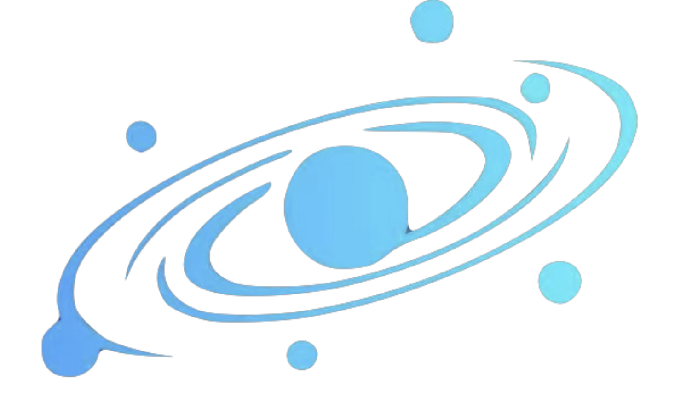

# Freedom Was Here

ASJ YINGDONG PHYSICS CLUB · DIGITAL MEMORIAL · ARCHIVE NO. 001 — ∞

!!! quote "A memorial to something that was loved"
    The club is in the past.
    The questions, the attempts, and the hours we stood side by side still belong to us.

    Left to the past, and left for afterwards.

## Beyond physics, there was us — exploring freely

The ASJ Yingdong Physics Club set out to build a platform: **a place for students to understand physics, express physics, and practise physics in their own way.**

What it left behind is collected here — speech scripts, event plans, design work, and photographs. The club no longer exists, but the things that were done in earnest deserve to be remembered.

## The collection

-   __It began with a "why"__

    ---

    The club's story / its aims and its footprints

    [:octicons-arrow-right-24: Read the club's story](story/index.md)

-   __Folding curiosity into a wing__

    ---

    The Flight Project / what one sheet of A4 can do

    [:octicons-arrow-right-24: Enter the Flight Project](flight/index.md)

-   __Kept as it was__

    ---

    Surviving Originals / photographs, designs and assembly scripts

    [:octicons-arrow-right-24: Open the surviving originals](collection/index.md)

-   __How the money worked, who stood where__

    ---

    Rules & Merit / dues, rosters and record-keeping

    [:octicons-arrow-right-24: View rules and merit](system/index.md)

-   __How this account was put together__

    ---

    About This Site / the list of sources and the editorial notes

    [:octicons-arrow-right-24: Read about this site](about/index.md)

## More than a name

A club badge, one page of a speech, one attempt to hand an idea over to two hands.
**Freedom once had these concrete shapes.**

!!! warning "How this site records things"
    This site records only the fragments that **can be confirmed** in the surviving material.

    - No attempt is made to fill in the unknown reason or date of the club's suspension;
    - Where the sources disagree on dates, **each version is kept side by side**; no final outcome is inferred;
    - Drafts in the expired design directory are archived **as drafts only**, and are not assumed to be the version actually issued.

    See [Thanks and Afterword · editorial notes](about/thanks/index.md).
