# 集會原稿

06 / THE MEMORY COLLECTION · THE ASSEMBLY ROOM

## 把時間，翻回那一頁

2026 年春季的三份集會演示文稿。**31 頁內容**，保留原有順序。

!!! info "關於內容口徑"
    以下各頁均**保留原稿原貌**，包括其中尚未落地的設想。
    方案中的招新、會費與系統設計均視為**歷史材料**，本站不提供報名、收款或社團賬號服務。

=== "04.21 · 集會暨招新"

    **完整 PDF · 12 頁** —— [打開原稿](../../assets/originals/assembly-421.pdf){ target=_blank }

    流程是固定的：發牌 → 紙飛機活動 → 競賽成果 → 招新 → 自媒體部門 → 會費說明。

    01. 集會封面
    02. 關於社團
    03. 運營人員頒牌
    04. 教師社牌頒發
    05. 會費說明
    06. 科技節紙飛機
    07. 關於招新
    08. 活動照片
    09. 自媒體部門
    10. 競賽成果展示
    11. Q&A
    12. 感謝聆聽

=== "04.27 · 計劃的下一頁"

    **完整 PDF · 14 頁** —— [打開原稿](../../assets/originals/assembly-427.pdf){ target=_blank }

    這一版更新了紙飛機挑戰賽時間與報名方式，並第一次完整攤開貢獻積分制度的構想。

    01. 紙飛機活動更新
    02. 場地布局
    03. 折法教學展示
    04. 自媒體部門競選
    05. 積分系統簡介
    06. 社費與貢獻積分說明
    07. 為什麼需要制度
    08. 社費與積分的區別
    09. 系統展示
    10. 積分邊界
    11. 制度流程
    12. 實施步驟
    13. 規則展示
    14. 參與和記錄

    → 制度正文見 [會費與貢獻積分](../governance/fees.md)

=== "05.12 · 向未來的設想"

    **完整 PDF · 5 頁** —— [打開原稿](../../assets/originals/assembly-512.pdf){ target=_blank }

    演示文稿出現**奇點、星雲、脈衝星、磁陀星**四個小組，以及社團**功勳系統**的展示。

    01. 集會封面
    02. 會員公開白皮書
    03. 功勳系統視頻頁
    04. 會費記錄截圖
    05. 小組分組表（原稿隱藏頁）

    → 分組名單見 [組織架構與名單](../governance/roster.md)
    → 功勳系統見 [功勳系統](../merit/index.md)

## 逐頁原件

### 04.21 集會暨招新

- 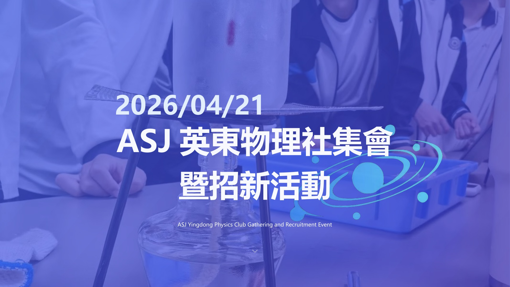
- 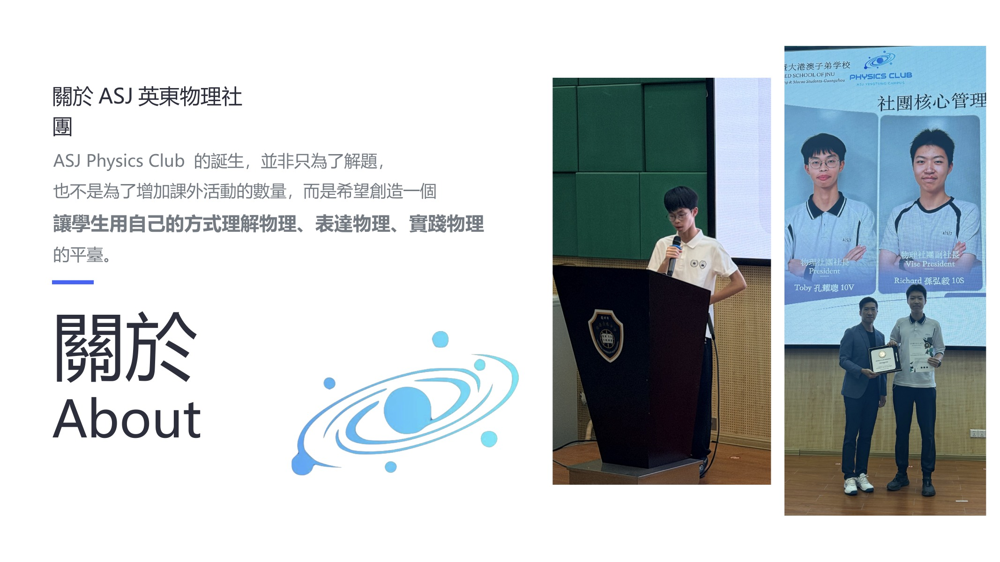
- 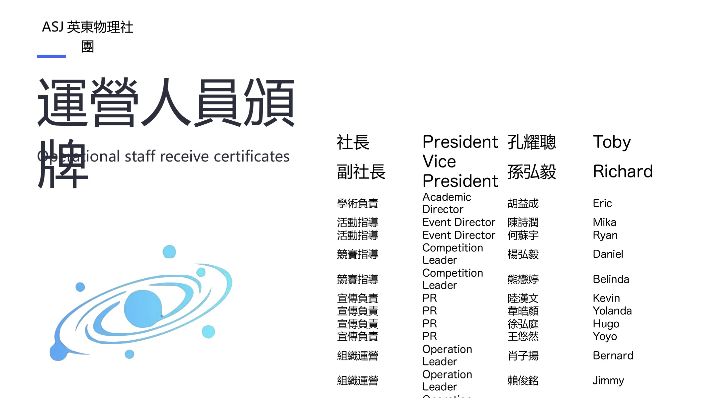
- 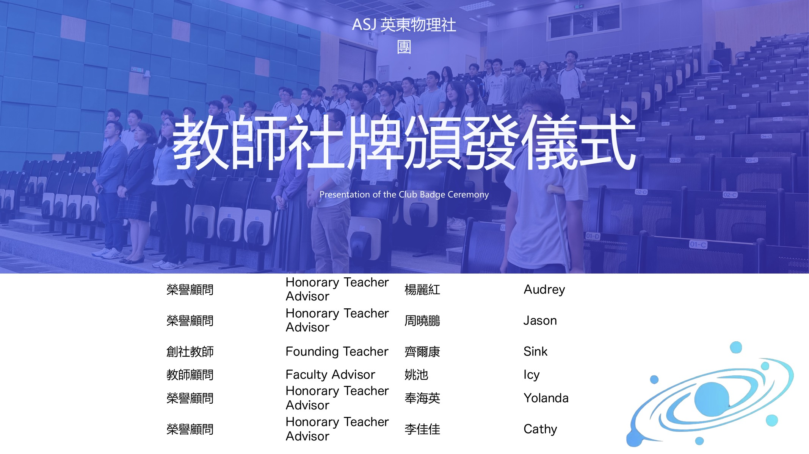
- 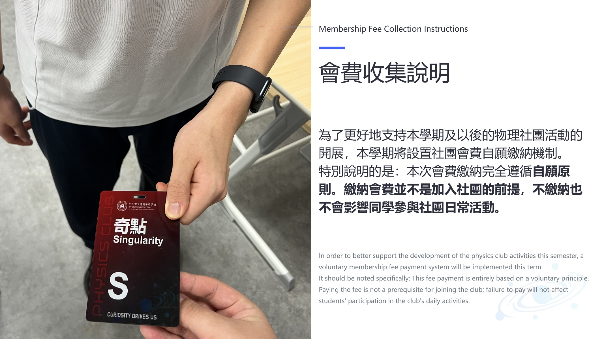
- 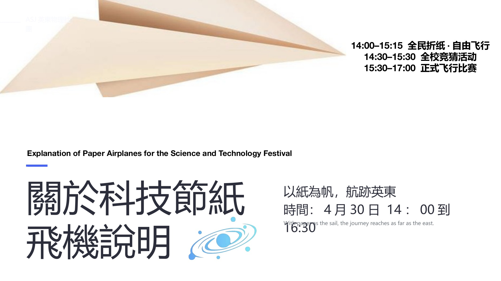
- 
- 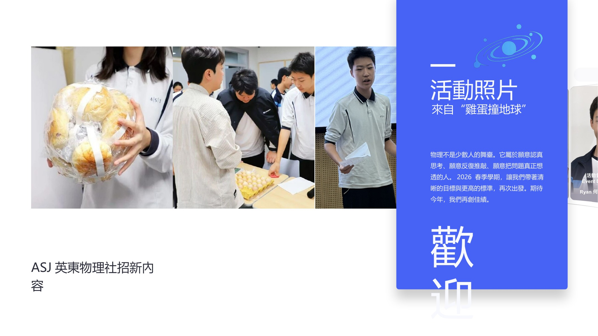
- 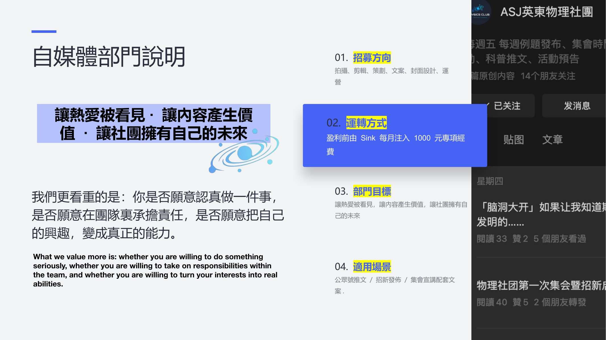
- 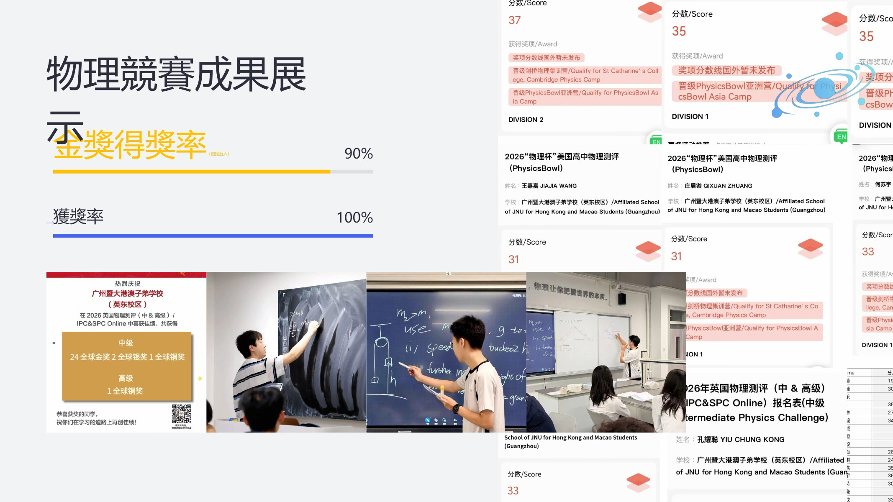
- 
- 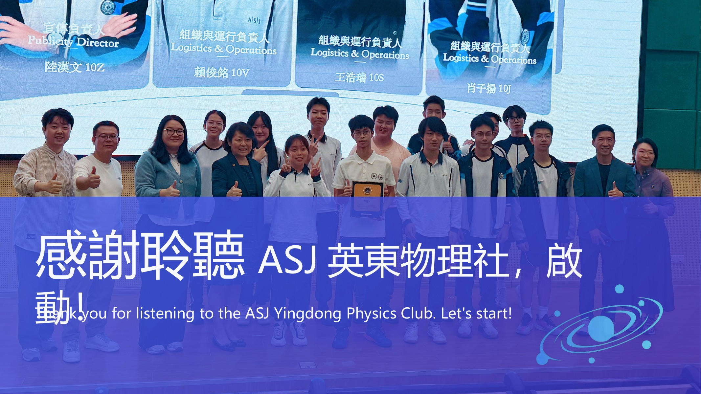

### 04.27 計劃的下一頁

- 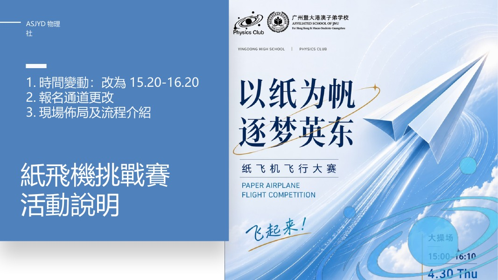
- 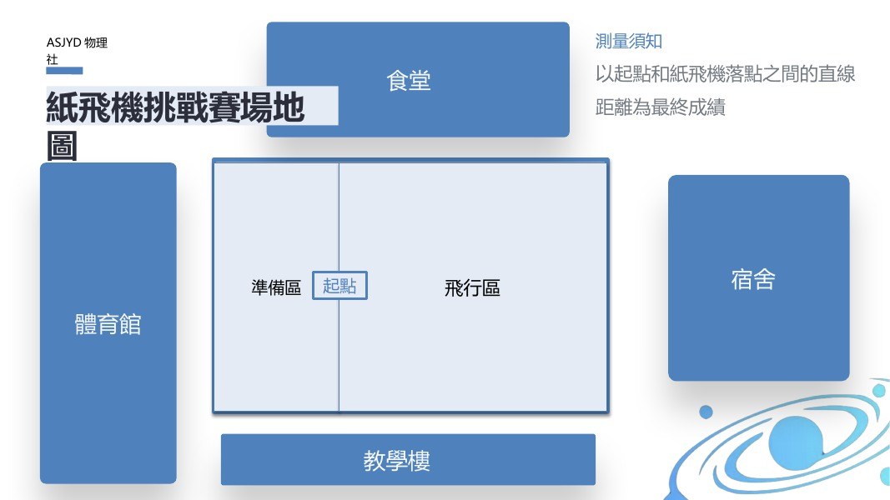
- 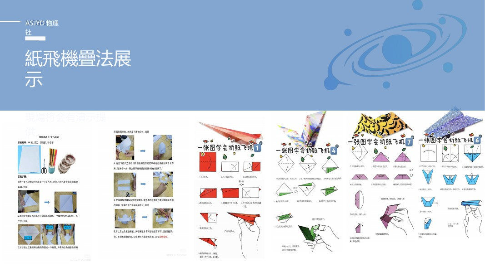
- 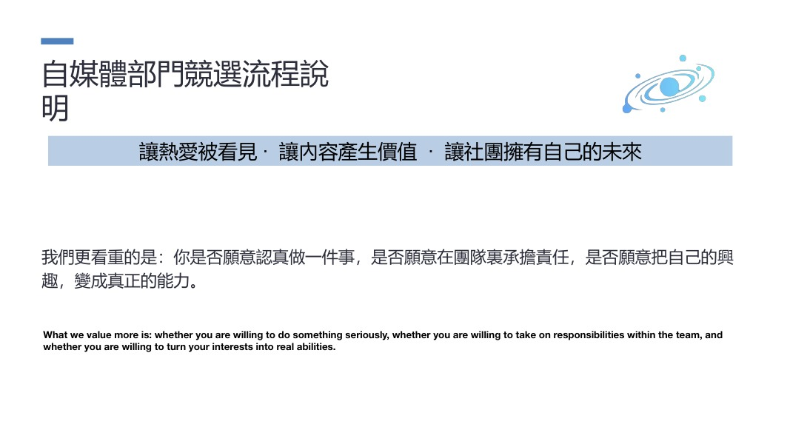
- 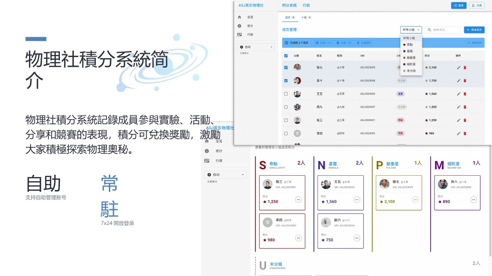
- 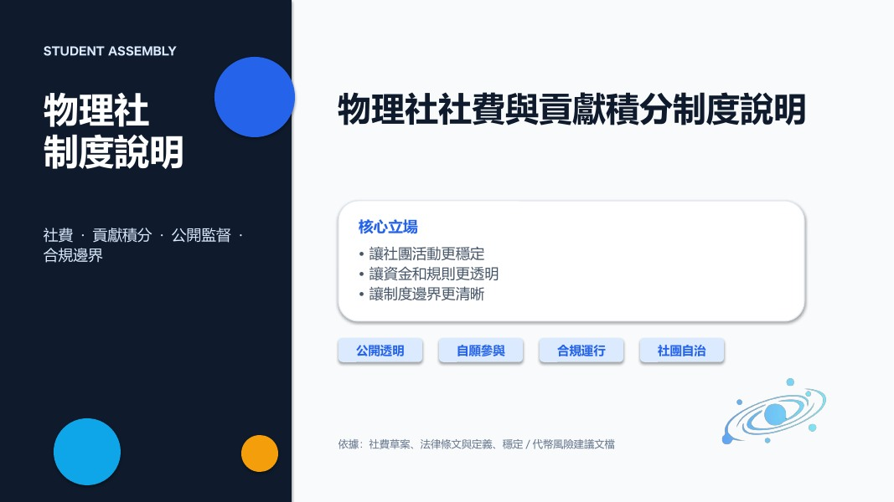
- 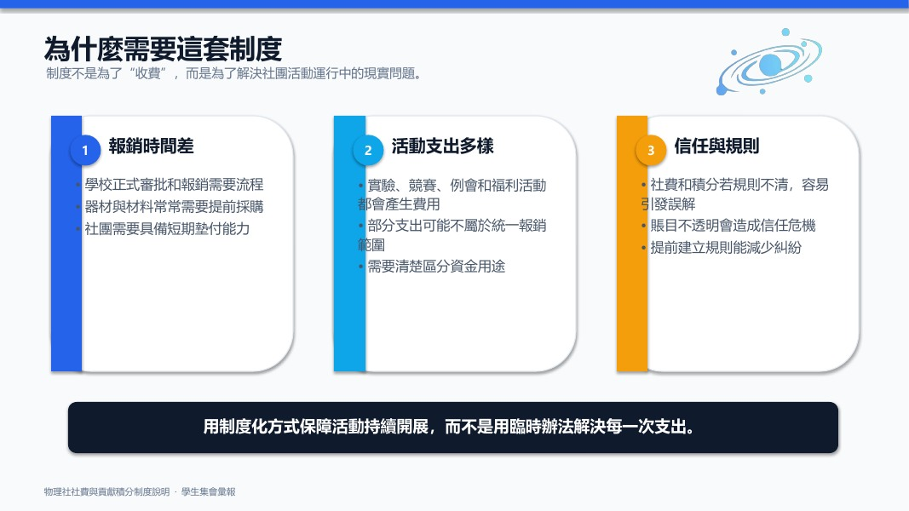

!!! note "其餘各頁"
    04.27 與 05.12 的完整逐頁圖保留在 `docs/assets/originals/`，
    文件名規則為 `assembly-<日期>-<页序>.jpg`，與本頁清單一一對應。

## 視頻

留存的功勳系統演示視頻：`assets/originals/system-demo.mp4`

<video controls preload="metadata" src="../../assets/originals/system-demo.mp4" style="max-width:100%"></video>
